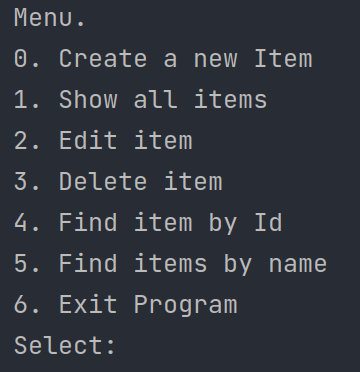
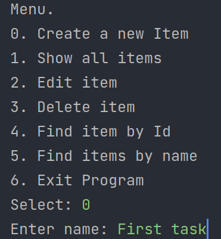
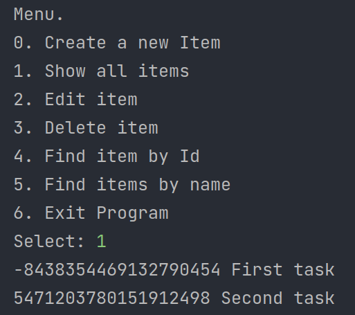

# Проект - Tracker

## Описание
Проект представляет собой консольное приложение CRUD-системы заявок.
Главный класс - ru.job4j.tracker.StartUI. Все заявки хранятся в памяти приложения.

Возможно выполнять следующие действия с заявками:

* Create a new item - Создать новую заявку
* Show all items - Вывести список всех заявок
* Edit item - Отредактировать заявку
* Delete item - Удалить заявку
* Find item by Id - Найти заявку по id
* Find items by name - Вывести список всех заявок с одинаковым названием
* Exit Program - Выйти

## Технологии
* Java 11
* Java Collections  
* PostgreSQL
* JDBC
* Junit, Mockito
* SLF4J/LOG4J
* JaCoCo  
* Maven

## Функциональность

#### Главное меню

#### Добавление задачи

#### Просмотр всех задач

#### Контакты

&nbsp;
&nbsp;
&nbsp;